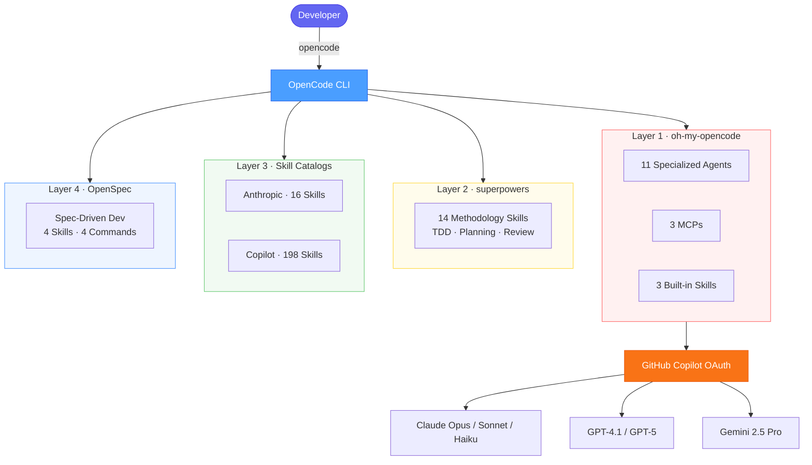

# my_AI_workspace

> **The most complete AI coding workspace you can clone in 30 seconds.**

A production-ready [OpenCode](https://opencode.ai) workspace that assembles the best open-source AI agent layers into one unified, reproducible environment. Stop configuring. Start building.

```bash
git clone https://github.com/ppea/my_AI_workspace my-project
cd my-project
./scripts/bootstrap.sh
opencode
```

---

## Why my_AI_workspace?

Most developers spend hours wiring up AI tools — installing plugins, hunting for skills, tuning model configs, writing prompt templates. **my_AI_workspace does all of that for you, once, reproducibly.**

| Pain point | What this solves |
|---|---|
| "I have to set up AI tools from scratch for every project" | Clone once, bootstrap once, reuse everywhere |
| "I don't know what skills/agents are available" | 257 capabilities catalogued in `registry.yaml` + `CATALOG.md` |
| "My team uses different configs" | Profiles (`minimal`, `daily-dev`, `full-stack`) checked into git |
| "Anthropic/OpenAI API keys are expensive" | Works with **GitHub Copilot OAuth** — no direct API keys required |
| "I want to use Claude/GPT/Gemini" | All routed through GitHub Copilot: 21+ models, one login |
| "I need agents for different tasks" | 11 specialized agents: orchestrator, coder, architect, reviewer, planner... |

---

## What's Inside

**257 capabilities across 4 layers, zero manual wiring.**

```
11 Agents  ·  3 MCPs  ·  239 Skills  ·  4 Commands
```

### Layer 1 — oh-my-opencode (Agent Orchestration)

11 specialized AI agents, each with a distinct role:

| Agent | Role |
|---|---|
| **Sisyphus** | Persistent orchestrator — breaks down and delegates complex tasks |
| **Hephaestus** | Code generation — turns specs into working implementation |
| **Prometheus** | Architecture & planning — designs systems before they're built |
| **Oracle** | Knowledge & research — answers questions, finds patterns |
| **Atlas** | Refactoring — safely restructures existing codebases |
| **Metis** | Strategic planning — long-horizon project management |
| **Momus** | Code review — finds bugs, anti-patterns, and improvements |
| **Librarian** | Context management — keeps long sessions coherent |
| **Explore** | Codebase search — fast navigation and discovery |
| **Multimodal** | Vision — reads screenshots, diagrams, and mockups |
| **Sisyphus Jr** | Light tasks — fast, cheap execution for simple ops |

3 MCPs for live context: **websearch** · **context7** (live docs) · **grep_app** (code search)

Activate full multi-agent orchestration with a single keyword:
```
ultrawork   # or: ulw
```

### Layer 2 — superpowers (Development Methodology)

14 methodology skills that enforce disciplined engineering:

- `/brainstorm` — Socratic design refinement before you write a line
- `/write-plan` — Structured implementation plan with checkpoints
- `/execute-plan` — TDD-driven execution with automated verification
- Code review, security audit, performance profiling, and more

### Layer 3 — Skill Catalogs (214 community skills)

The largest open skill collections, pre-installed and namespaced:

- **198 skills** from [github/awesome-copilot](https://github.com/github/awesome-copilot) — DevOps, CI/CD, testing, refactoring, security, MCP generators, language-specific skills (Python, Go, Rust, Java, C#, Swift, Kotlin, PHP, Ruby...)
- **16 skills** from [anthropics/skills](https://github.com/anthropics/skills) — frontend design, MCP builder, webapp testing, document generation (docx, pdf, pptx, xlsx), canvas design

### Layer 4 — OpenSpec (Spec-Driven Development)

Formalize changes before implementing them:

- `/opsx:propose` — Generate a machine-readable spec from your intent
- `/opsx:apply` — Implement spec tasks one by one, with review gates

---

## Quick Start

### Prerequisites

```bash
brew install git node anomalyco/tap/opencode
```

### 1. Clone and bootstrap

```bash
git clone https://github.com/ppea/my_AI_workspace my-project
cd my-project
./scripts/bootstrap.sh
```

Bootstrap handles everything: submodule init, plugin install, model config, skill symlinking, profile activation, registry generation, and a health check.

### 2. Authenticate (GitHub Copilot — no API key needed)

```bash
opencode auth login   # choose GitHub Copilot
```

GitHub Copilot OAuth gives you access to **21+ models** including Claude Sonnet/Opus, GPT-4.1/5, and Gemini 2.5 Pro — all from one login.

### 3. Start coding

```bash
opencode
```

All 257 capabilities are immediately available.

---

## Model Coverage

All models routed through **GitHub Copilot OAuth** — one login, no separate API keys:

| Model | Used by |
|---|---|
| `github-copilot/claude-opus-4.6` | Sisyphus, Oracle, Prometheus, Metis, Momus |
| `github-copilot/claude-sonnet-4.5` | Librarian, Atlas, general tasks |
| `github-copilot/claude-haiku-4.5` | Explore, Multimodal (fast + cheap) |
| `github-copilot/gpt-5`, `gpt-4.1` | Available on demand |
| `github-copilot/gemini-2.5-pro` | Available on demand |

Switch models at any time inside OpenCode — no config changes needed.

---

## Profiles

Match the active capability set to your current task:

```bash
./scripts/switch-profile.sh minimal      # fast, low-resource
./scripts/switch-profile.sh daily-dev    # balanced default
./scripts/switch-profile.sh full-stack   # everything, max concurrency
```

| Profile | Agents | MCPs | Concurrency |
|---|---|---|---|
| `minimal` | 7 | 1 | 1 |
| `daily-dev` | 10 | 3 | 3 |
| `full-stack` | 11 | 3 | 5 + auto_resume |

---

## Capability Registry

Every capability is catalogued and searchable:

```bash
cat registry.yaml    # machine-readable: 257 entries
cat CATALOG.md       # human-readable: grouped by category
```

Regenerate after any change:

```bash
python3 scripts/gen-registry.py   # rebuild registry.yaml
python3 scripts/gen-catalog.py    # rebuild CATALOG.md
```

---

## Add Your Own Skills

Drop a `SKILL.md` file into `skills/custom/<name>/`:

```markdown
---
name: my-skill
description: Use when the user asks for X
---

# Instructions

Your skill instructions here.
```

Run `./scripts/bootstrap.sh` — it's automatically symlinked and added to the registry.

---

## Directory Layout

```
my-project/
├── .opencode/              # OpenCode project config + OpenSpec commands
├── config/                 # Template configs (model assignments per agent)
├── vendor/                 # Git submodules — pinned, updatable
│   ├── oh-my-opencode/     #   11 agents, 3 MCPs, 3 built-in skills
│   ├── superpowers/        #   14 methodology skills
│   ├── anthropic-skills/   #   16 task skills
│   ├── awesome-copilot/    #   198 community skills
│   └── openspec/           #   spec-driven dev CLI + skills
├── profiles/               # minimal / daily-dev / full-stack configs
├── scripts/                # bootstrap, doctor, update, switch-profile
├── skills/custom/          # your own skills (auto-symlinked on bootstrap)
├── registry.yaml           # single source of truth — all 257 capabilities
└── CATALOG.md              # human-readable capability catalog
```

---

## Maintenance

```bash
./scripts/update.sh          # pull latest submodules + regenerate registry
./scripts/doctor.sh          # run health checks (symlinks, config, registry)
./scripts/switch-profile.sh  # switch active profile
```

---

## Architecture



---

## Components & Credits

| Layer | Source | What it provides |
|---|---|---|
| [oh-my-opencode](https://github.com/code-yeongyu/oh-my-opencode) | code-yeongyu | 11 agents, 3 MCPs, 3 built-in skills |
| [superpowers](https://github.com/obra/superpowers) | obra | 14 development methodology skills |
| [anthropic/skills](https://github.com/anthropics/skills) | Anthropic | 16 task skills (frontend, docs, MCP, office) |
| [awesome-copilot](https://github.com/github/awesome-copilot) | GitHub | 198 community skills across all domains |
| [OpenSpec](https://github.com/Fission-AI/OpenSpec) | Fission-AI | Spec-driven development workflow |

---

## License

[MIT](LICENSE) — Neo Yan 2026
