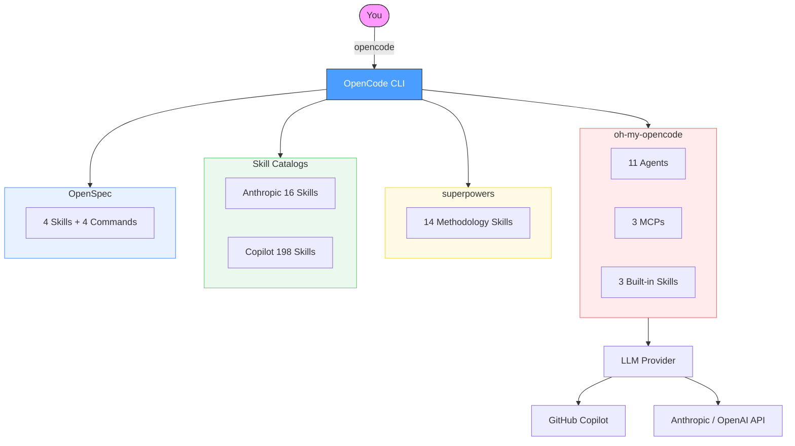
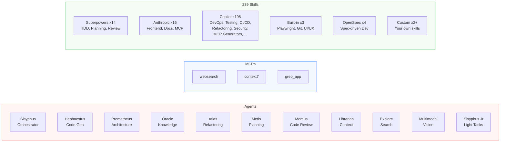
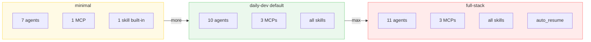
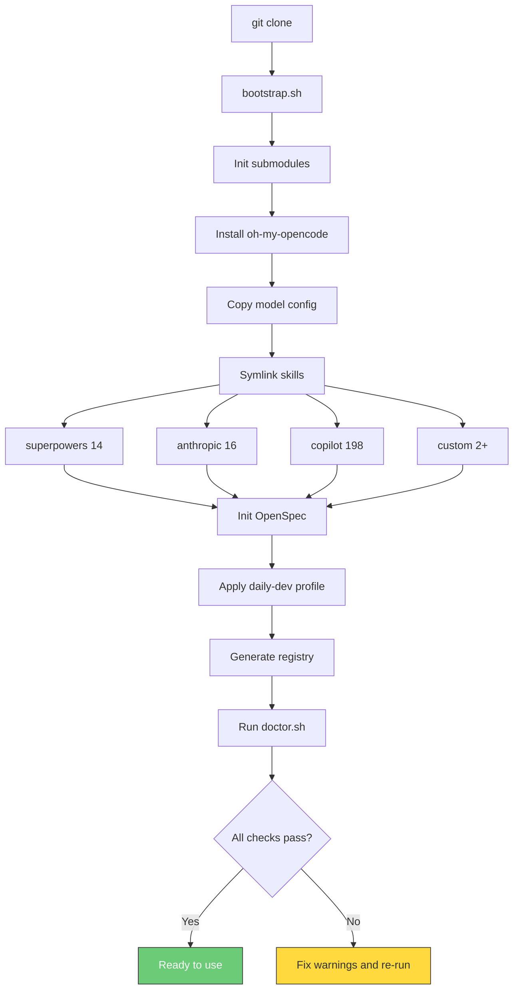

# my_AI_workspace

Clone, bootstrap, code. A ready-to-use OpenCode workspace with **257 capabilities** out of the box.

```
git clone <this-repo> my-project && cd my-project && ./scripts/bootstrap.sh
```

## How It Works



## Quick Start

### 1. Install prerequisites

```bash
brew install git node anomalyco/tap/opencode
```

### 2. Clone and bootstrap

```bash
git clone <this-repo> my-project
cd my-project
./scripts/bootstrap.sh
```

### 3. Authenticate

```bash
opencode auth login    # select GitHub Copilot, Anthropic, or OpenAI
```

### 4. Start coding

```bash
opencode
```

That's it. All 257 capabilities are ready to use.

## What's Inside



## Key Commands

| Command | What It Does |
|---------|-------------|
| `ultrawork` (or `ulw`) | Full multi-agent orchestration |
| `/brainstorm` | Socratic design refinement |
| `/write-plan` | Create an implementation plan |
| `/execute-plan` | Execute plan with TDD checkpoints |
| `/opsx:propose` | Start a spec-driven change |
| `/opsx:apply` | Implement tasks from a spec |

## Profiles

Switch how much capability is active:

```bash
./scripts/switch-profile.sh <profile>
```



## Bootstrap Flow



## Directory Layout

```
my-project/
├── .opencode/                # OpenCode config + OpenSpec commands
├── config/                   # Template configs (model assignments)
├── vendor/                   # Git submodules (5 repos)
│   ├── oh-my-opencode/       #   agents + MCPs + built-in skills
│   ├── superpowers/          #   methodology skills
│   ├── anthropic-skills/     #   task skills
│   ├── awesome-copilot/      #   community skills (198)
│   └── openspec/             #   spec-driven dev
├── profiles/                 # minimal / daily-dev / full-stack
├── scripts/                  # bootstrap, doctor, update, switch-profile
├── skills/custom/            # your own skills go here
├── registry.yaml             # capability registry (auto-generated)
└── CATALOG.md                # human-readable catalog (auto-generated)
```

## Add Your Own Skills

Create `skills/custom/<name>/SKILL.md`:

```markdown
---
name: my-skill
description: Use when the user asks for X
---

# Instructions

Your skill instructions here.
```

Run `./scripts/bootstrap.sh` to symlink it, or manually:

```bash
ln -s "$(pwd)/skills/custom/my-skill" ~/.config/opencode/skills/custom-my-skill
```

## Maintenance

```bash
./scripts/update.sh          # update submodules + regenerate registry
./scripts/doctor.sh          # run health checks
./scripts/switch-profile.sh  # switch active profile
```

## Components

| Layer | Repository | Count |
|-------|-----------|-------|
| oh-my-opencode | [code-yeongyu/oh-my-opencode](https://github.com/code-yeongyu/oh-my-opencode) | 11 agents, 3 MCPs, 3 skills |
| superpowers | [obra/superpowers](https://github.com/obra/superpowers) | 14 skills |
| anthropics/skills | [anthropics/skills](https://github.com/anthropics/skills) | 16 skills |
| awesome-copilot | [github/awesome-copilot](https://github.com/github/awesome-copilot) | 198 skills |
| OpenSpec | [Fission-AI/OpenSpec](https://github.com/Fission-AI/OpenSpec) | 4 skills, 4 commands |
| custom | your own | 2+ skills |
