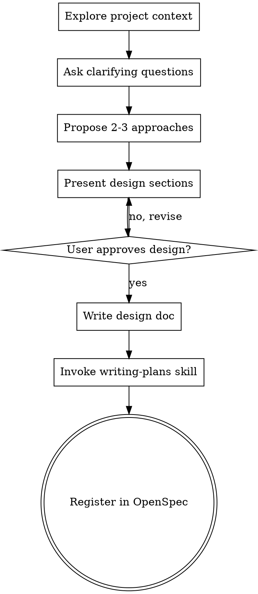

# Brainstorm → OpenSpec Auto-Registration Implementation Plan

> **For Claude:** REQUIRED SUB-SKILL: Use superpowers:executing-plans to implement this plan task-by-task.

**Goal:** Create a local brainstorming skill override that automatically registers OpenSpec changes after every writing-plans invocation, enabling full lifecycle tracking per project.

**Architecture:** A `skills/custom/brainstorming/SKILL.md` file overrides the vendor superpowers brainstorming skill by adding step 7 (OpenSpec registration) to the checklist. User skills take priority over vendor skills automatically. The skill detects the active project, auto-inits OpenSpec if needed, copies docs/plans artifacts into a self-contained OpenSpec change, and commits.

**Tech Stack:** OpenCode skill system (SKILL.md), OpenSpec CLI v1.2.0 (`/opt/homebrew/bin/openspec`), Bash (within skill instructions), Git

---

### Task 1: Read vendor brainstorming skill (reference only)

**Files:**
- Read: `~/.config/opencode/skills/superpowers/brainstorming/SKILL.md`

**Step 1: Confirm current vendor skill content**

Verify the full current content of the vendor skill at:
`/Users/mac/.config/opencode/skills/superpowers/brainstorming/SKILL.md`

Expected: 96-line file ending with the checklist items 1–6 and Key Principles section.

**Step 2: Confirm custom skill directory exists**

Run:
```bash
ls /Users/mac/code/My_AI_workspace_227/skills/custom/
```

Expected: directories for `code-simplifier/`, `find-skills/`, and (not yet) `brainstorming/`

---

### Task 2: Create custom brainstorming skill override

**Files:**
- Create: `skills/custom/brainstorming/SKILL.md`

**Step 1: Create directory**

```bash
mkdir -p /Users/mac/code/My_AI_workspace_227/skills/custom/brainstorming
```

**Step 2: Create the SKILL.md file**

Create `skills/custom/brainstorming/SKILL.md` with the full content of the vendor skill PLUS step 7 added to the checklist and a new "Step 7: Register in OpenSpec" section.

The file must:
- Start with identical frontmatter (`name: brainstorming`, same description)
- Include ALL original content verbatim (96 lines worth) — no behavior regression
- Add step 7 to the checklist after step 6
- Add a new "## Step 7: Register in OpenSpec" section after the existing "## After the Design" section
- Add the `## OpenSpec Registration` implementation instructions

Full file content:

```markdown
---
name: brainstorming
description: "You MUST use this before any creative work - creating features, building components, adding functionality, or modifying behavior. Explores user intent, requirements and design before implementation."
---

# Brainstorming Ideas Into Designs

## Overview

Help turn ideas into fully formed designs and specs through natural collaborative dialogue.

Start by understanding the current project context, then ask questions one at a time to refine the idea. Once you understand what you're building, present the design and get user approval.

<HARD-GATE>
Do NOT invoke any implementation skill, write any code, scaffold any project, or take any implementation action until you have presented a design and the user has approved it. This applies to EVERY project regardless of perceived simplicity.
</HARD-GATE>

## Anti-Pattern: "This Is Too Simple To Need A Design"

Every project goes through this process. A todo list, a single-function utility, a config change — all of them. "Simple" projects are where unexamined assumptions cause the most wasted work. The design can be short (a few sentences for truly simple projects), but you MUST present it and get approval.

## Checklist

You MUST create a task for each of these items and complete them in order:

1. **Explore project context** — check files, docs, recent commits
2. **Ask clarifying questions** — one at a time, understand purpose/constraints/success criteria
3. **Propose 2-3 approaches** — with trade-offs and your recommendation
4. **Present design** — in sections scaled to their complexity, get user approval after each section
5. **Write design doc** — save to `docs/plans/YYYY-MM-DD-<topic>-design.md` and commit
6. **Transition to implementation** — invoke writing-plans skill to create implementation plan
7. **Register in OpenSpec** — auto-register design + plan as a tracked OpenSpec change

## Process Flow



**The terminal state is registering in OpenSpec.** Do NOT invoke frontend-design, mcp-builder, or any other implementation skill. The ONLY skill you invoke after brainstorming is writing-plans, followed by OpenSpec registration.

## The Process

**Understanding the idea:**
- Check out the current project state first (files, docs, recent commits)
- Ask questions one at a time to refine the idea
- Prefer multiple choice questions when possible, but open-ended is fine too
- Only one question per message - if a topic needs more exploration, break it into multiple questions
- Focus on understanding: purpose, constraints, success criteria

**Exploring approaches:**
- Propose 2-3 different approaches with trade-offs
- Present options conversationally with your recommendation and reasoning
- Lead with your recommended option and explain why

**Presenting the design:**
- Once you believe you understand what you're building, present the design
- Scale each section to its complexity: a few sentences if straightforward, up to 200-300 words if nuanced
- Ask after each section whether it looks right so far
- Cover: architecture, components, data flow, error handling, testing
- Be ready to go back and clarify if something doesn't make sense

## After the Design

**Documentation:**
- Write the validated design to `docs/plans/YYYY-MM-DD-<topic>-design.md`
- Use elements-of-style:writing-clearly-and-concisely skill if available
- Commit the design document to git

**Implementation:**
- Invoke the writing-plans skill to create a detailed implementation plan
- Do NOT invoke any other skill. writing-plans is the next step.

## Step 7: Register in OpenSpec

After writing-plans completes and the implementation plan is saved to `docs/plans/`, run the OpenSpec registration procedure below.

**This step is idempotent** — if an OpenSpec change with the same name already exists, log a notice and skip.

## OpenSpec Registration

### 7.1 Determine project root and change name

- The **project root** is the git repo root of the files being worked on (not necessarily the workspace). Use `git rev-parse --show-toplevel` from any file modified during the session.
- Derive a kebab-case change name from the brainstorm topic (e.g. `brainstorm-openspec-integration`, `nextme-phase4-voice`).

### 7.2 Ensure OpenSpec is initialized in the project

```bash
# From the project root:
ls openspec/
```

If `openspec/` does NOT exist:
```bash
cd <project-root>
openspec init
git add openspec/
git commit -m "chore(openspec): initialize openspec"
```

### 7.3 Check idempotency — skip if change already exists

```bash
openspec list --json 2>/dev/null | grep -q '"<change-name>"'
```

If the change name is found: **log a notice and stop**:
> "OpenSpec change `<change-name>` already exists — skipping registration."

### 7.4 Create the OpenSpec change

```bash
cd <project-root>
openspec new change <change-name>
```

This creates `openspec/changes/<change-name>/` with empty artifact files.

### 7.5 Write proposal.md

Write a 1–2 paragraph WHY summary derived from the design rationale. This should capture:
- The problem being solved
- Why this approach was chosen over alternatives

File: `openspec/changes/<change-name>/proposal.md`

### 7.6 Copy design doc → design.md

```bash
cp docs/plans/YYYY-MM-DD-<topic>-design.md openspec/changes/<change-name>/design.md
```

### 7.7 Copy implementation plan → tasks.md

```bash
cp docs/plans/YYYY-MM-DD-<topic>-implementation.md openspec/changes/<change-name>/tasks.md
```

### 7.8 Commit the OpenSpec change

```bash
cd <project-root>
git add openspec/changes/<change-name>/
git commit -m "chore(openspec): register <change-name> change"
```

### 7.9 Confirm success

Output:
> "OpenSpec change `<change-name>` registered in `openspec/changes/<change-name>/`. Use `/opsx-apply` to begin implementation."

## Key Principles

- **One question at a time** - Don't overwhelm with multiple questions
- **Multiple choice preferred** - Easier to answer than open-ended when possible
- **YAGNI ruthlessly** - Remove unnecessary features from all designs
- **Explore alternatives** - Always propose 2-3 approaches before settling
- **Incremental validation** - Present design, get approval before moving on
- **Be flexible** - Go back and clarify when something doesn't make sense
```

**Step 3: Verify file was created correctly**

```bash
wc -l /Users/mac/code/My_AI_workspace_227/skills/custom/brainstorming/SKILL.md
```

Expected: ~140+ lines. File must start with `---` frontmatter and end with Key Principles section.

---

### Task 3: Bootstrap the new skill (symlink)

The workspace bootstrap script symlinks skills/custom into `~/.config/opencode/skills/`. Verify the symlink gets created.

**Step 1: Check if bootstrap auto-symlinks or if manual symlink is needed**

```bash
ls -la ~/.config/opencode/skills/ | grep brainstorming
```

If no symlink exists yet:

**Step 2: Create symlink manually**

```bash
ln -s /Users/mac/code/My_AI_workspace_227/skills/custom/brainstorming \
      ~/.config/opencode/skills/brainstorming
```

**Step 3: Verify symlink**

```bash
ls -la ~/.config/opencode/skills/brainstorming/
```

Expected: shows `SKILL.md` in the directory.

**Step 4: Verify skill takes priority over vendor skill**

User skills at `~/.config/opencode/skills/brainstorming/` override vendor skills at `~/.config/opencode/skills/superpowers/brainstorming/` automatically per the OpenCode skill priority rules.

Confirm by checking the path resolution order in AGENTS.md or opencode config:
```bash
grep -r "skill.*priority\|user.*override\|priority.*user" \
  /Users/mac/code/My_AI_workspace_227/AGENTS.md
```

---

### Task 4: Initialize OpenSpec in nextme repo

**Files:**
- Run command in: `~/code/nextme/`

**Step 1: Check if openspec/ already exists**

```bash
ls ~/code/nextme/openspec/ 2>/dev/null && echo "EXISTS" || echo "NOT FOUND"
```

Expected: `NOT FOUND`

**Step 2: Initialize OpenSpec**

```bash
cd ~/code/nextme
openspec init
```

Expected: creates `openspec/` directory with `changes/` and `specs/` subdirectories.

**Step 3: Verify structure**

```bash
ls ~/code/nextme/openspec/
```

Expected: `changes/  specs/`

**Step 4: Commit**

```bash
cd ~/code/nextme
git add openspec/
git commit -m "chore(openspec): initialize openspec"
```

---

### Task 5: Self-test — register THIS change in workspace OpenSpec

Validate the new skill works by manually running the step 7 procedure for the brainstorm-openspec-integration change itself (on the workspace repo).

**Step 1: Check workspace OpenSpec state**

```bash
ls /Users/mac/code/My_AI_workspace_227/openspec/changes/
```

Expected: currently empty.

**Step 2: Run openspec new change**

```bash
cd /Users/mac/code/My_AI_workspace_227
openspec new change brainstorm-openspec-integration
```

**Step 3: Write proposal.md**

File: `openspec/changes/brainstorm-openspec-integration/proposal.md`

Content:
```markdown
The brainstorm → writing-plans workflow produces design docs and implementation plans
in docs/plans/, but these were never tracked anywhere. There was no way to know which
plans were in-flight, being implemented, or completed. Each project had orphaned plan
files with no lifecycle.

This change adds automatic OpenSpec registration as step 7 of the brainstorming skill.
After every writing-plans invocation, the resulting design doc and implementation plan
are copied into a self-contained OpenSpec change. This enables the full lifecycle:
brainstorm → OpenSpec change created → /opsx-apply → /opsx-archive.
The approach was chosen as a local skill override (vs. patching the vendor submodule)
to keep the vendor clean and enable easy future updates.
```

**Step 4: Copy design doc**

```bash
cp /Users/mac/code/My_AI_workspace_227/docs/plans/2026-02-28-brainstorm-openspec-integration-design.md \
   /Users/mac/code/My_AI_workspace_227/openspec/changes/brainstorm-openspec-integration/design.md
```

**Step 5: Copy implementation plan**

```bash
cp /Users/mac/code/My_AI_workspace_227/docs/plans/2026-02-28-brainstorm-openspec-integration-implementation.md \
   /Users/mac/code/My_AI_workspace_227/openspec/changes/brainstorm-openspec-integration/tasks.md
```

**Step 6: Commit**

```bash
cd /Users/mac/code/My_AI_workspace_227
git add openspec/changes/brainstorm-openspec-integration/
git commit -m "chore(openspec): register brainstorm-openspec-integration change"
```

**Step 7: Verify**

```bash
ls /Users/mac/code/My_AI_workspace_227/openspec/changes/brainstorm-openspec-integration/
```

Expected: `proposal.md  design.md  tasks.md`

---

### Task 6: Commit skill override and push both repos

**Step 1: Commit skills/custom/brainstorming/ in workspace**

```bash
cd /Users/mac/code/My_AI_workspace_227
git add skills/custom/brainstorming/
git add docs/plans/2026-02-28-brainstorm-openspec-integration-implementation.md
git commit -m "feat(skills): add brainstorming override with openspec auto-registration (step 7)"
```

**Step 2: Push workspace**

```bash
cd /Users/mac/code/My_AI_workspace_227
git push origin feat/lifeos-phase1
```

**Step 3: Push nextme (openspec init commit)**

```bash
cd ~/code/nextme
git push
```

**Step 4: Verify both pushes**

```bash
cd /Users/mac/code/My_AI_workspace_227 && git log --oneline -3
cd ~/code/nextme && git log --oneline -3
```

---

## Summary

| Task | What it does |
|---|---|
| Task 1 | Confirm vendor skill content + custom skill dir |
| Task 2 | Create `skills/custom/brainstorming/SKILL.md` with step 7 |
| Task 3 | Symlink custom skill so it overrides vendor skill |
| Task 4 | `openspec init` in nextme repo |
| Task 5 | Self-test: register THIS change in workspace OpenSpec |
| Task 6 | Commit everything + push both repos |
